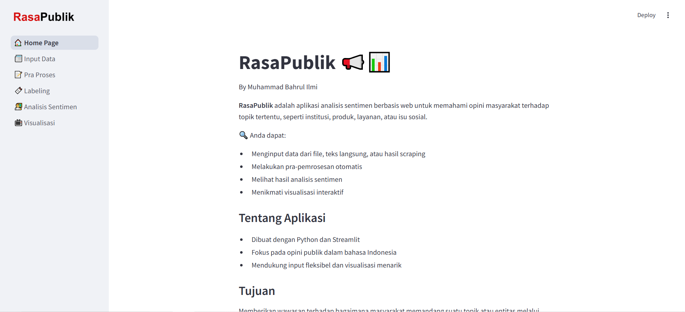

# 🇮🇩 Rasa Publik — Sentiment Analysis of Public Opinion on X
Rasa Publik is a web-based sentiment analysis application that captures and analyzes public opinion—especially from X—on various topics related to public discourse in Indonesia. It allows users to collect tweets, classify sentiments, and visualize overall public mood and trending themes.

## 🔍 Preview


## 📌 Features

- 📝 **Flexible Input**: Upload text/CSV files or scrape data from the web.
- ⚙️ **Preprocessing Pipeline**: Cleans, tokenizes, and normalizes Indonesian text.
- 💬 **Sentiment Analysis**: Classifies text into positive, neutral, or negative.
- 📊 **Visualization**: Provides charts and metrics for better insight.
- 🌐 **Web Interface**: Built with Streamlit for a responsive and interactive UI.

## 🛠️ Built With

- [Python](https://www.python.org/)
- [Streamlit](https://streamlit.io/)

## 🚀 Getting Started

### 1. Clone this repository

```bash
git clone https://github.com/yourusername/rasapublik.git
cd rasapublik
